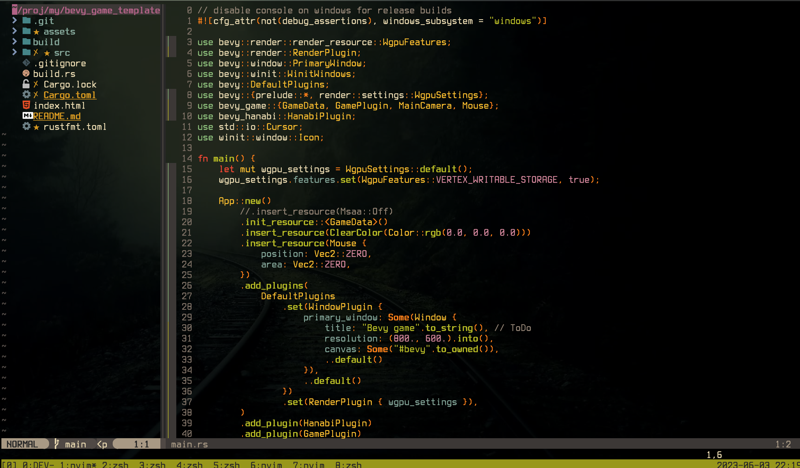
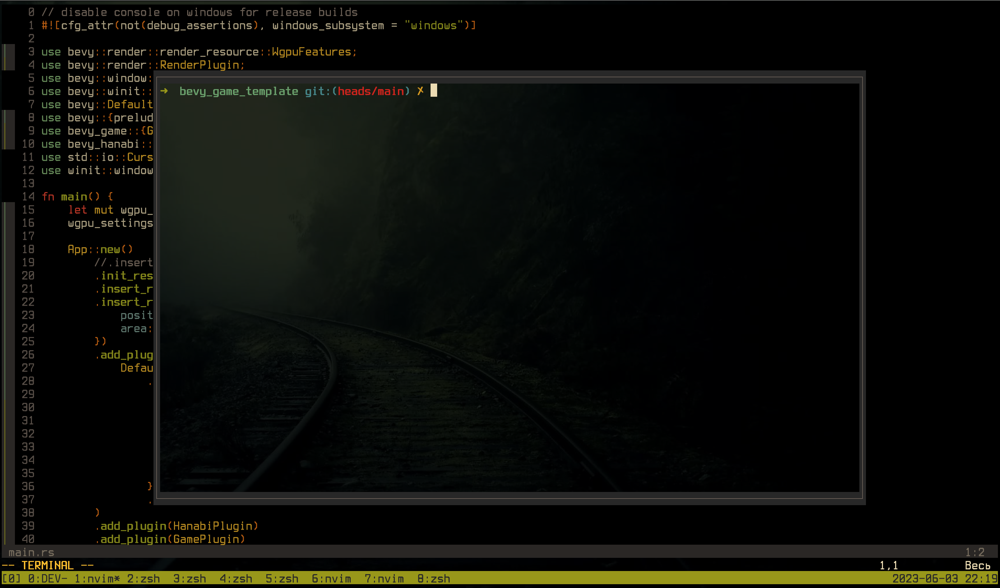
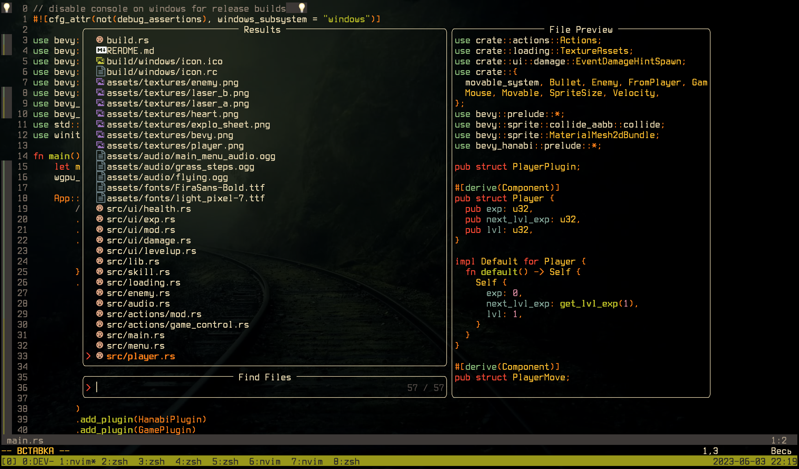
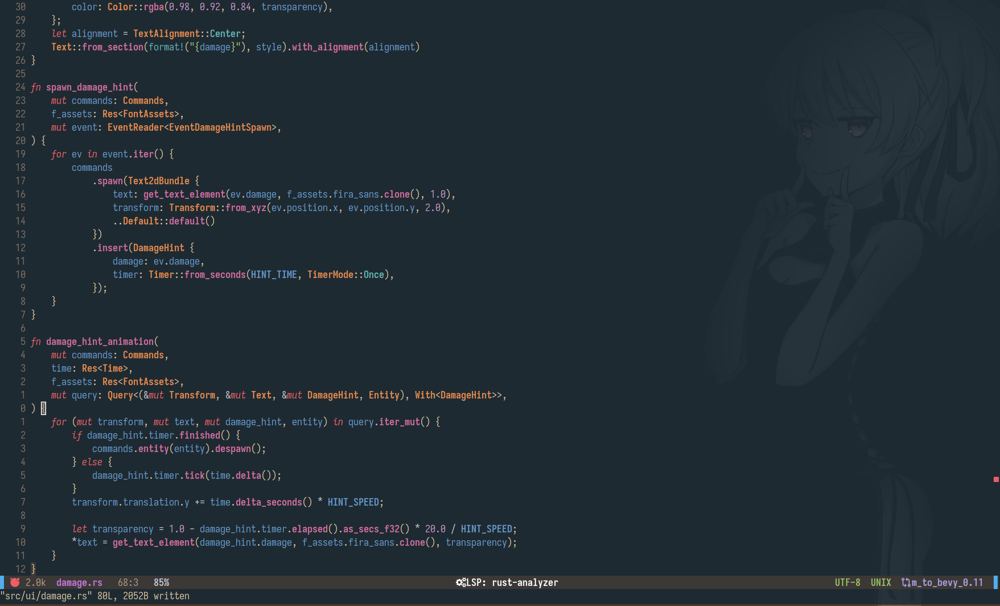
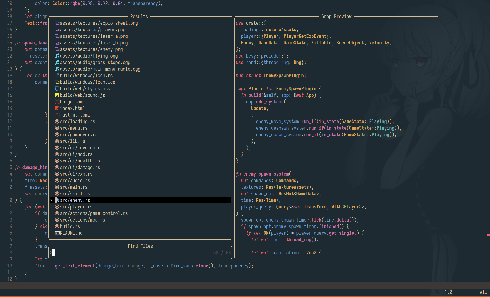

<a name="readme-top"></a>

<!-- PROJECT SHIELDS -->
[![Contributors][contributors-shield]][contributors-url]
[![Forks][forks-shield]][forks-url]
[![Stargazers][stars-shield]][stars-url]
[![Issues][issues-shield]][issues-url]
[![MIT License][license-shield]][license-url]
[![LinkedIn][linkedin-shield]][linkedin-url]


<!-- PROJECT LOGO -->
<br />
<div align="center">

<h3 align="center">My Neovim, alacritty, left-wm and etc. linux configs</h3>

  <p align="center">
    One file Neovim config. It make IDE from powerfull editor. (TESTED only on MACos but it must be work for linux)
    <br />
    <a href="https://github.com/zaqxsw-dev/my-vim-config"><strong>Explore the docs »</strong></a>
    <br />
    <br />
    <a href="https://github.com/zaqxsw-dev/my-vim-config/issues">Report Bug</a>
    ·
    <a href="https://github.com/zaqxsw-dev/my-vim-config/issues">Request Feature</a>
  </p>
</div>


<!-- TABLE OF CONTENTS -->
<details>
  <summary>Table of Contents</summary>
  <ol>
    <li>
      <a href="#about-the-project">About The Project</a>
      <a href="#features">Features</a>
    </li>
    <li>
      <a href="#requirements">Requirements</a>
      <a href="#getting-started">Getting Started</a>
    </li>
    <li><a href="#usage">Usage</a></li>
    <li><a href="#contributing">Contributing</a></li>
    <li><a href="#license">License</a></li>
    <li><a href="#contact">Contact</a></li>
  </ol>
</details>


<!-- ABOUT THE PROJECT -->
## About The Project

This project created for save my current Neovim config.

In macos (Old)





In linux (new)





<p align="right">(<a href="#readme-top">back to top</a>)</p>

## Features

1. Autoformat for php html js jsx rust(prettier, rust tools)
2. Treesitter improoved syntax hightlight
3. Lsp(autocomplete and code actions) for php html js jsx rust etc
4. File and code finder using telescope and fzf
5. Git integration using git signs
6. Terminal intergration using float term (lspsaga)
7. Colortheme GRUVBOX
8. Transparency backgoround
9. Support old vim plugins and configs
10. Font icons(need patched NERD FONT)


<p align="right">(<a href="#readme-top">back to top</a>)</p>

## Requirements

1. Install fzf from brew
2. Install ripgrep from brew
3. Install packer <a href="https://github.com/wbthomason/packer.nvim">Repo</a>

<p align="right">(<a href="#readme-top">back to top</a>)</p>


<!-- GETTING STARTED -->
## Getting Started

1. Install plugins using packer 
```
:PackerInstall
```
2. Install syntax parsers using Treesitter 
```
:TSInstall rust
```
3. Install lsp servers using LspInstall 
```
:LspInstall javascript
```


<p align="right">(<a href="#readme-top">back to top</a>)</p>

<!-- CONTRIBUTING -->
## Contributing

Contributions are what make the open source community such an amazing place to learn, inspire, and create. Any contributions you make are **greatly appreciated**.

If you have a suggestion that would make this better, please fork the repo and create a pull request. You can also simply open an issue with the tag "enhancement".
Don't forget to give the project a star! Thanks again!

1. Fork the Project
2. Create your Feature Branch (`git checkout -b feature/AmazingFeature`)
3. Commit your Changes (`git commit -m 'Add some AmazingFeature'`)
4. Push to the Branch (`git push origin feature/AmazingFeature`)
5. Open a Pull Request

<p align="right">(<a href="#readme-top">back to top</a>)</p>


<!-- LICENSE -->
## License

Distributed under the MIT License. See `LICENSE.txt` for more information.

<p align="right">(<a href="#readme-top">back to top</a>)</p>


<!-- CONTACT -->
## Contact

Bogdan Lipovtsev - megafreelancer2012@gmail.com

Project Link: [https://github.com/zaqxsw-dev/my-vim-config](https://github.com/zaqxsw-dev/my-vim-config)

<p align="right">(<a href="#readme-top">back to top</a>)</p>

<!-- MARKDOWN LINKS & IMAGES -->
<!-- https://www.markdownguide.org/basic-syntax/#reference-style-links -->
[contributors-shield]: https://img.shields.io/github/contributors/zaqxsw-dev/my-vim-config.svg?style=for-the-badge
[contributors-url]: https://github.com/zaqxsw-dev/my-vim-config/graphs/contributors
[forks-shield]: https://img.shields.io/github/forks/zaqxsw-dev/my-vim-config.svg?style=for-the-badge
[forks-url]: https://github.com/zaqxsw-dev/my-vim-config/network/members
[stars-shield]: https://img.shields.io/github/stars/zaqxsw-dev/my-vim-config.svg?style=for-the-badge
[stars-url]: https://github.com/zaqxsw-dev/my-vim-config/stargazers
[issues-shield]: https://img.shields.io/github/issues/zaqxsw-dev/my-vim-config.svg?style=for-the-badge
[issues-url]: https://github.com/zaqxsw-dev/my-vim-config/issues
[license-shield]: https://img.shields.io/github/license/zaqxsw-dev/my-vim-config.svg?style=for-the-badge
[license-url]: https://github.com/zaqxsw-dev/my-vim-config/blob/master/LICENSE.txt
[linkedin-shield]: https://img.shields.io/badge/-LinkedIn-black.svg?style=for-the-badge&logo=linkedin&colorB=555
[linkedin-url]: https://www.linkedin.com/in/bogdan-lipovtsev-746946257
